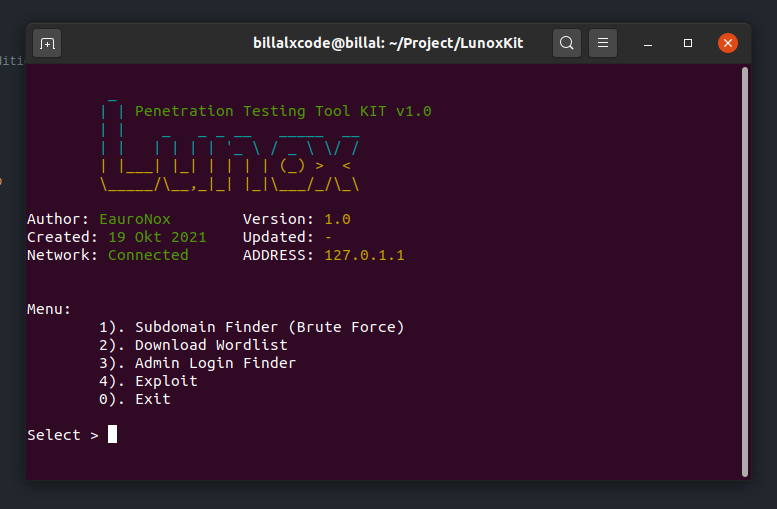
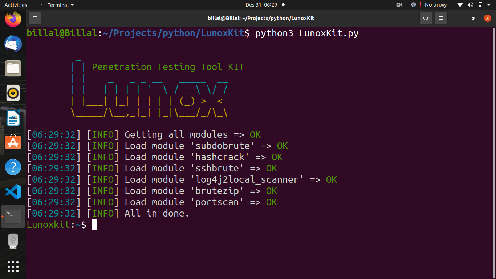
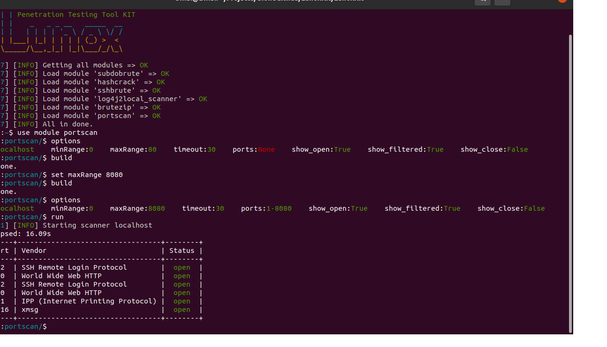

# Indonesian
## Pengenalan
Lunox adalah sebuah alat yang dapat menguji sebuah sistem keamanan. Lunox dibangun menggunakan bahasa pemrogramman Python versi 3.7 ke atas. Alat ini berbasis Command Line Interface (CLI) sehingga dibutuhkan kemampuan untuk menjalankan alat ini.

## Cara pasang
Alat ini dapat berjalan di platform linux saja, kemungkinan update berikut nya sudah dapat di jalankan di platform seperti Windows ataupun MacOS. Alat ini sudah di uji di platform Linux dengan Distro Ubuntu 20.04.

### Linux
Untuk memasang alat ini, masukan perintah berikut:
- Install Paket Pendukung
```shell
> sudo apt-get install python3 python3-pip git
```
- Cloning alat dari github
```shell
> git clone https://github.com/billalxcode/LunoxKit
```
- Jalankan alat
```shell
> python3 LunoxKit.py
```

# English
## Introduction
Lunox is a tool that can test a security system. Lunox is built using the Python programming language version 3.7 and above. This tool is based on the Command Line Interface (CLI) so it takes the ability to run this tool.

## How to install
This tool can run on the Linux platform only, it is possible that the next update can already be run on platforms such as Windows or MacOS. This tool has been tested on the Linux platform with Ubuntu 20.04 distribution.
### Linux
To install this tool, enter the following command:
- Install Support Packages
```shell
> sudo apt-get install python3 python3-pip git
```
- Cloning tool from github
```shell
> git clone https://github.com/billalxcode/LunoxKit
```
- Run tool
```shell
> python3 LunoxKit.py
```

# Preview
## LunoxKit v2

## Port scanner module


# License
Alat ini berlisensi GPL (General Public License)
```
                    GNU GENERAL PUBLIC LICENSE
                       Version 3, 29 June 2007

 Copyright (C) 2007 Free Software Foundation, Inc. <https://fsf.org/>
 Everyone is permitted to copy and distribute verbatim copies
 of this license document, but changing it is not allowed.
```
